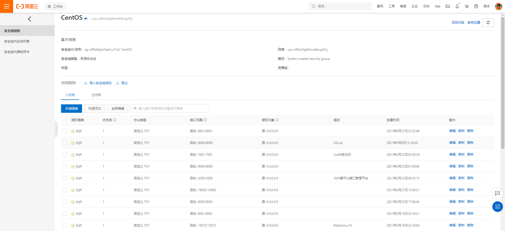
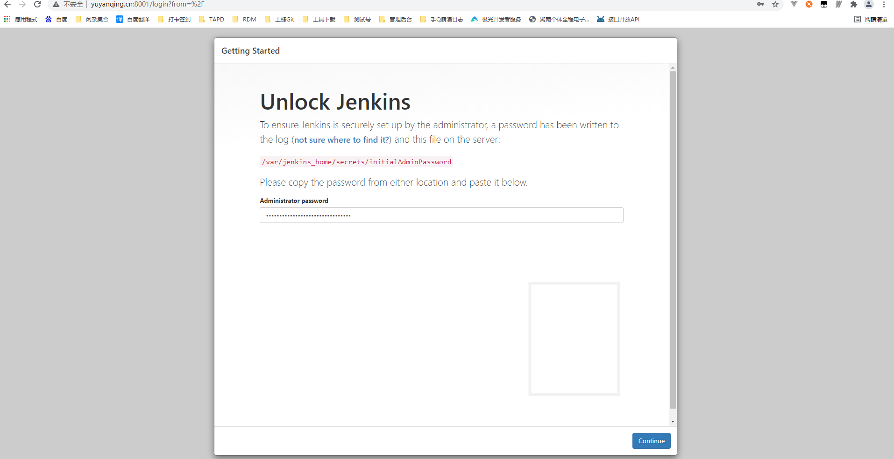
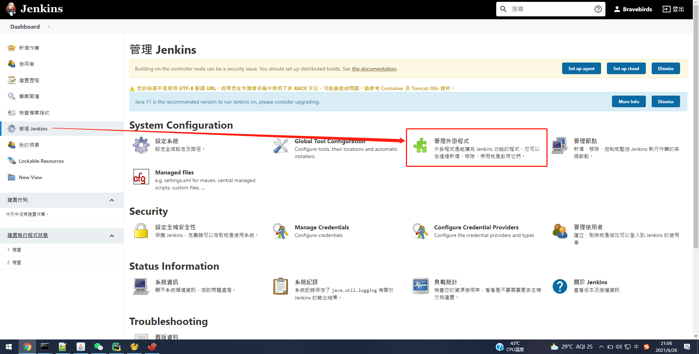
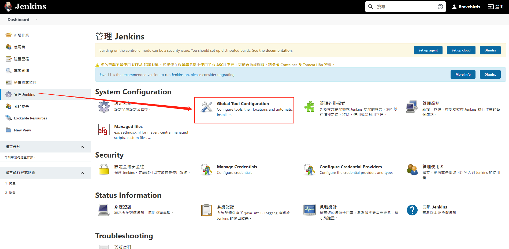
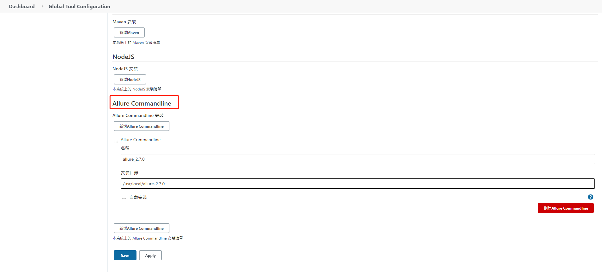
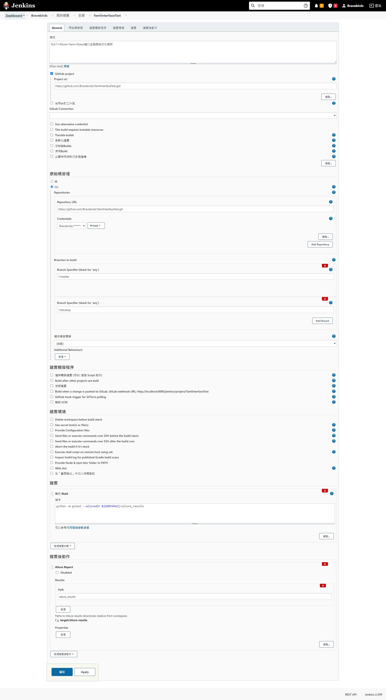
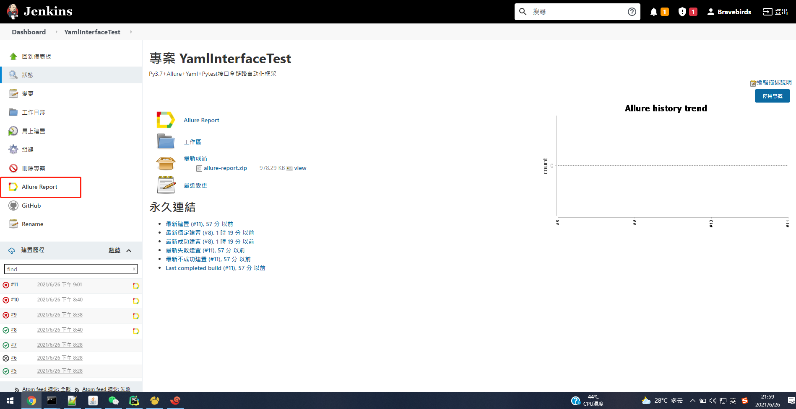
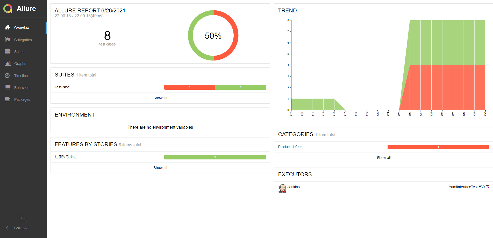
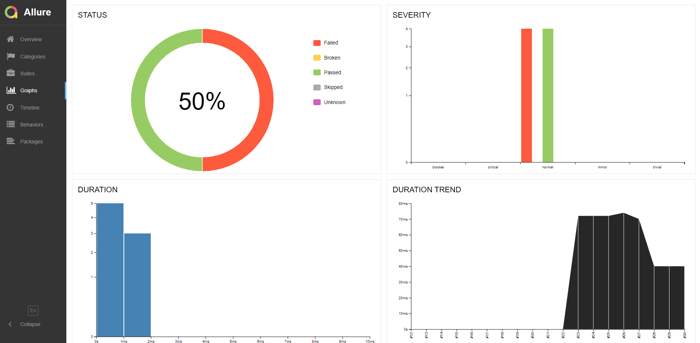
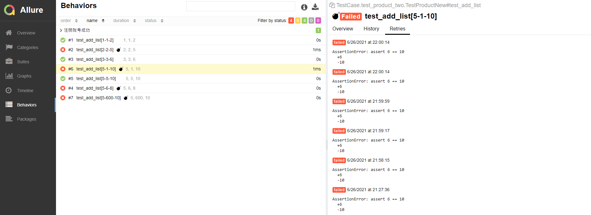

## Jenkins平台+Allure插件部署项目 
### 第一步、安装并配置Jenkins环境
#### 1、创建并启动（8080端口占用，配置其它（8001）端口）
```
查看docker的jenkins镜像版本
[root@mryu docker]# docker search jenkins
NAME                                    DESCRIPTION                                     STARS     OFFICIAL   AUTOMATED
jenkins                                 Official Jenkins Docker image                   5215      [OK]       
jenkins/jenkins                         The leading open source automation server       2568             
...........................................
[root@mryu /]# mkdir /home/jenkins/
[root@mryu /]# chmod 1000:1000 /home/jenkins/
[root@mryu /]# mkdir /usr/local/jenkins/
[root@mryu /]# chmod 777 /usr/local/jenkins/
[root@mryu /]# chown -R jenkins:jenkins /usr/local/jenkins/
[root@mryu /]# docker run -d -p 8001:8080 -p 8002:50000 -v /home/jenkins:/usr/local/jenkins -v /etc/localtime:/etc/localtime --name jenkins jenkins/jenkins
a052de1c5bae72fb88caeda6fb00775adb264bda830b0e31ac573c8ea8ec73fb
```

####  2、配置镜像加速目录。
```
[root@mryu jenkins]# cd /usr/local/jenkins/
[root@mryu jenkins]# vi hudson.model.UpdateCenter.xml
# 原来的参数：
<?xml version='1.1' encoding='UTF-8'?>
<sites>
  <site>
    <id>default</id>
    <url>https://updates.jenkins.io/update-center.json</url>
  </site>
</sites>
# 将 url 修改为 清华大学官方镜像：https://mirrors.tuna.tsinghua.edu.cn/jenkins/updates/update-center.json
```
#### 3、开放端口
```
//打开 iptables 的配置文件： 
# vim /etc/sysconfig/iptables 
//如果该 iptables 配置文件 不存在，先执行
#  yum install iptables-services   //安装。
//iptables文件中添加以下内容
firewall-cmd --permanent --zone=public --add-port=8001/tcp
firewall-cmd --permanent --zone=public --add-port=8001/udp
//执行
#  firewall-cmd --reload     //重启防火墙，使最新的防火墙设置规则生效。
```


#### 5、访问并初始化

```
若是一直卡在这里，那么需要查看下日志
[root@mryu jenkins]# docker logs jenkins
Running from: /usr/share/jenkins/jenkins.war
webroot: EnvVars.masterEnvVars.get("JENKINS_HOME")
创建下jenkins_home 重启即可 其它问题暂无遇到
```
#### 访问正常情况则开始设置密码
```
[root@mryu jenkins]# docker logs jenkins
2021-06-26 15:39:16.102+0000 [id=27]	INFO	jenkins.install.SetupWizard#init: 
Jenkins initial setup is required. An admin user has been created and a password generated.
Please use the following password to proceed to installation:
32bc5be9b0c341c7b824d6e1bea8cde6 （密码）
This may also be found at: /var/jenkins_home/secrets/initialAdminPassword
```



### 第二步、安装Allure插件
#### 1、进入插件管理页

#### 2、搜索allure插件并进行安装

#### 3、检查是否安装成功

### 第二步、配置全局变量
#### 1、进入配置页

#### 2、设置allure安装路径 （切勿使用自动安装，一般都会失败、可手动安装后配置路径即可）


### 第三步、配置项目规则
#### 1、执行shell中的report路径需要与allure_report插件保持一致

#### 2、检查是否有Allure_Report入口(若没有或点击时报错则先手动构建拉下代码)

#### 3、空的时候allure报告样式 

#### 5、执行几次之后就可以看到趋势图了



